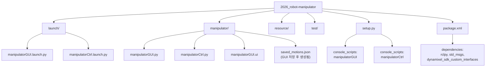
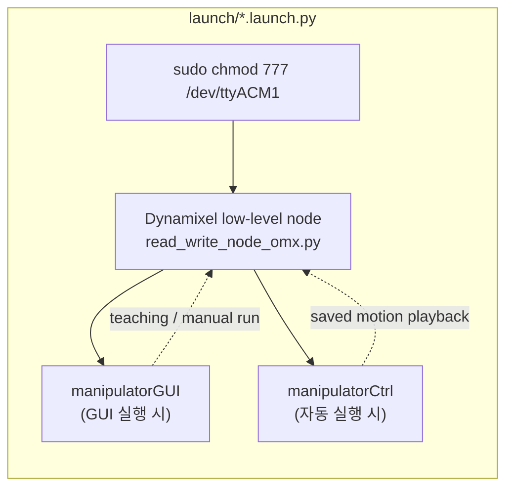
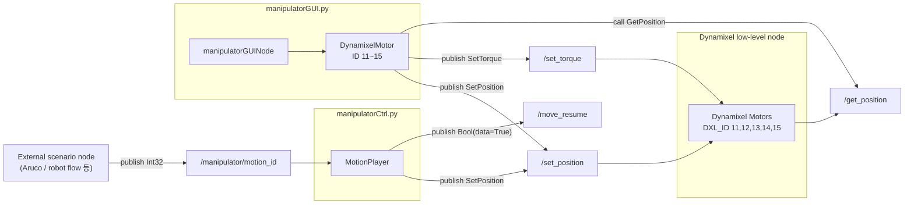
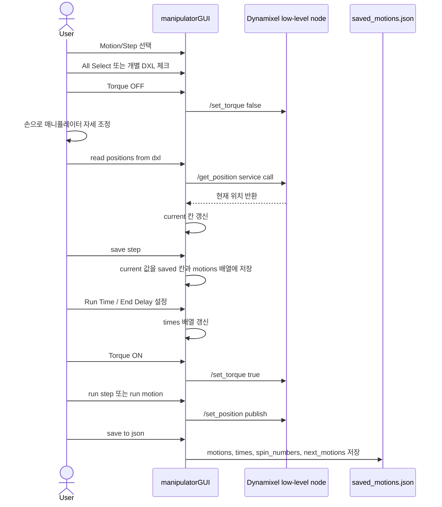
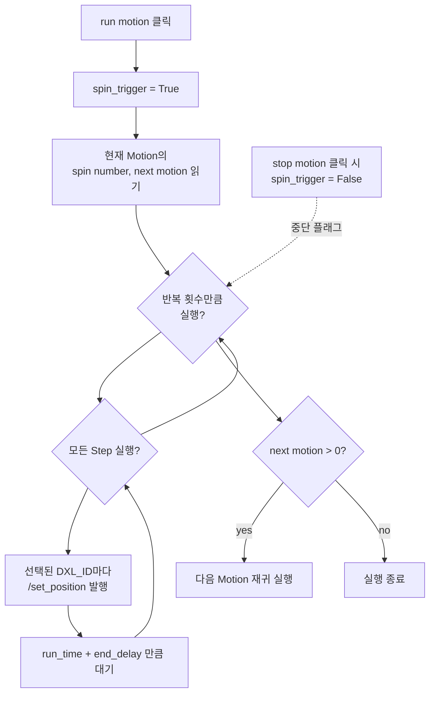
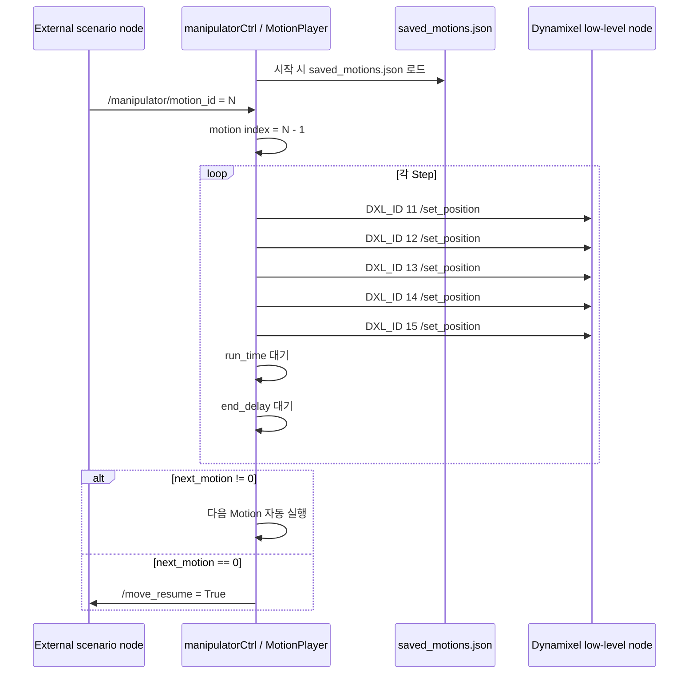
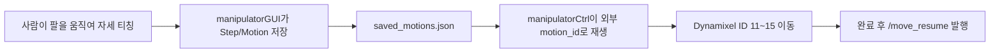

# Manipulator Package Architecture

이 문서는 현재 패키지의 코드 구조와 매니퓰레이터 동작 흐름을 한눈에 보기 위해 만든 설명서입니다.

핵심은 두 개의 ROS 2 노드입니다.

- `manipulatorGUI`: 사용자가 직접 자세를 가르치고 Motion/Step을 JSON으로 저장하는 GUI 노드
- `manipulatorCtrl`: 저장된 JSON 모션을 외부 명령(`/manipulator/motion_id`)으로 실행하는 자동 재생 노드

## 1. 패키지 구조



## 2. 전체 실행 구조

두 launch 파일 모두 먼저 Dynamixel low-level 노드를 실행합니다.

이 low-level 노드는 실제 Dynamixel과 통신하고, 이 패키지의 GUI/Ctrl 노드는 ROS 토픽과 서비스로만 명령을 주고받습니다.



## 3. ROS 토픽과 서비스 연결



### 주요 인터페이스

| 이름 | 방향 | 메시지/서비스 | 역할 |
| --- | --- | --- | --- |
| `/set_position` | GUI/Ctrl -> Dynamixel | `SetPosition` | 특정 ID 모터를 목표 위치로 이동 |
| `/set_torque` | GUI -> Dynamixel | `SetTorque` | 선택된 모터 Torque ON/OFF |
| `/get_position` | GUI -> Dynamixel | `GetPosition` service | 현재 모터 위치 읽기 |
| `/manipulator/motion_id` | 외부 -> Ctrl | `Int32` | 저장된 Motion 번호 실행 요청 |
| `/move_resume` | Ctrl -> 외부 | `Bool` | 모션 종료 후 다음 시나리오 진행 신호 |

## 4. Motion 데이터 구조

GUI에서 만든 모션은 내부적으로 다음 형태로 저장됩니다.

```python
self.motions = [
    [
        [pos_id11, pos_id12, pos_id13, pos_id14, pos_id15],  # step 1
        [pos_id11, pos_id12, pos_id13, pos_id14, pos_id15],  # step 2
    ],
]

self.times = [
    [
        [run_time, end_delay],  # step 1
        [run_time, end_delay],  # step 2
    ],
]
```

인덱스 의미는 다음과 같습니다.

```text
motions[motion_index][step_index][dxl_index] = position
times[motion_index][step_index] = [run_time, end_delay]

dxl_index 0 -> DXL_ID 11
dxl_index 1 -> DXL_ID 12
dxl_index 2 -> DXL_ID 13
dxl_index 3 -> DXL_ID 14
dxl_index 4 -> DXL_ID 15
```

JSON 저장 시에는 다음 값들이 함께 저장됩니다.

```json
{
  "motions": [],
  "times": [],
  "spin_numbers": [],
  "next_motions": []
}
```

## 5. GUI 티칭 흐름



## 6. GUI에서 run motion 동작

`run motion` 버튼을 누르면 현재 선택된 Motion의 Step들이 순서대로 실행됩니다.



## 7. 자동 실행 노드 동작

`manipulatorCtrl.py`는 GUI 없이 저장된 JSON을 재생합니다.



## 8. 코드별 역할 정리

### `manipulatorGUI.py`

- PyQt5 GUI와 ROS 2 Node를 동시에 상속합니다.
- `DynamixelMotor` 클래스로 각 모터 ID를 감쌉니다.
- 버튼 클릭 콜백에서 토크, 위치 읽기, 위치 저장, 모션 실행, JSON 저장/불러오기를 처리합니다.
- GUI 실행 중에는 별도 thread에서 `rclpy.spin()`을 돌려 Qt 이벤트 루프와 ROS 콜백을 같이 사용합니다.

### `manipulatorCtrl.py`

- 시작 시 `saved_motions.json`을 읽습니다.
- `/manipulator/motion_id`를 받으면 해당 Motion을 실행합니다.
- Motion 실행 중에는 중복 실행을 막기 위해 `is_playing` 플래그를 사용합니다.
- Motion이 끝나고 다음 Motion이 없으면 `/move_resume`으로 완료 신호를 보냅니다.

### `manipulatorGUI.ui`

- Qt Designer에서 만든 화면 배치 파일입니다.
- 코드에서 `uic.loadUiType()`으로 읽어 Python GUI 객체에 연결합니다.
- `readButton`, `torqueOnButton`, `stepRunButton` 같은 위젯 이름이 `manipulatorGUI.py`의 콜백과 연결됩니다.

### `launch/manipulatorGUI.launch.py`

- 포트 권한 설정
- Dynamixel low-level node 실행
- `manipulatorGUI` 실행

### `launch/manipulatorCtrl.launch.py`

- 포트 권한 설정
- Dynamixel low-level node 실행
- `manipulatorCtrl` 실행

## 9. 한 줄 요약


