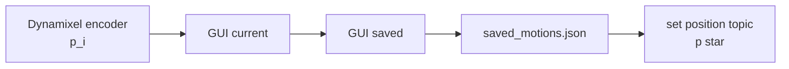
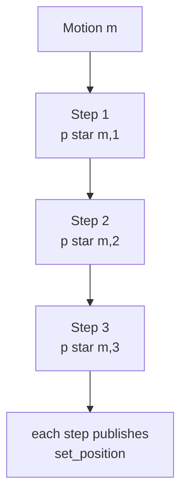
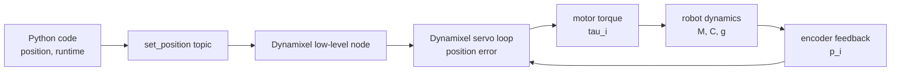
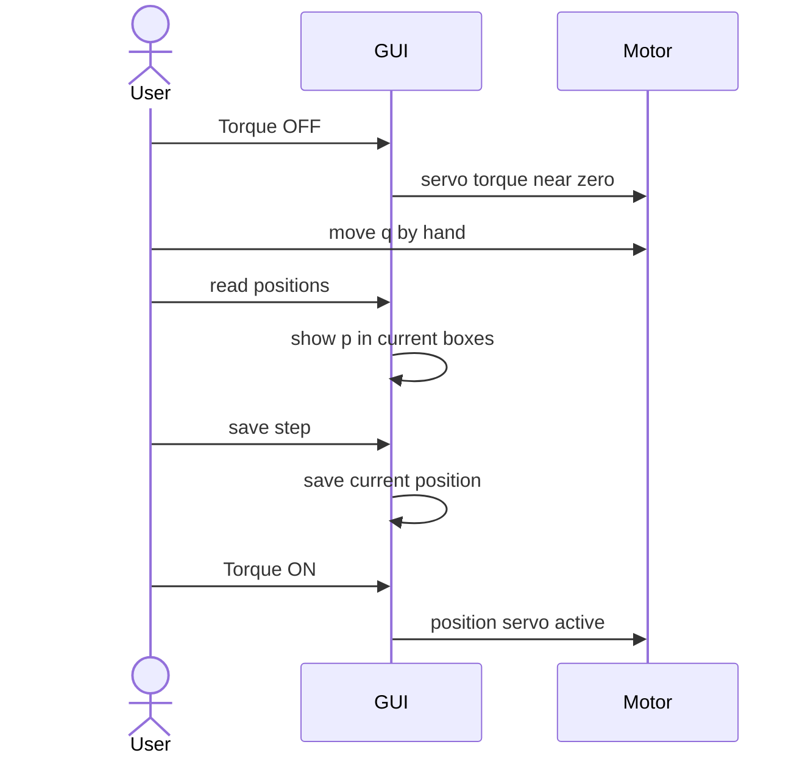
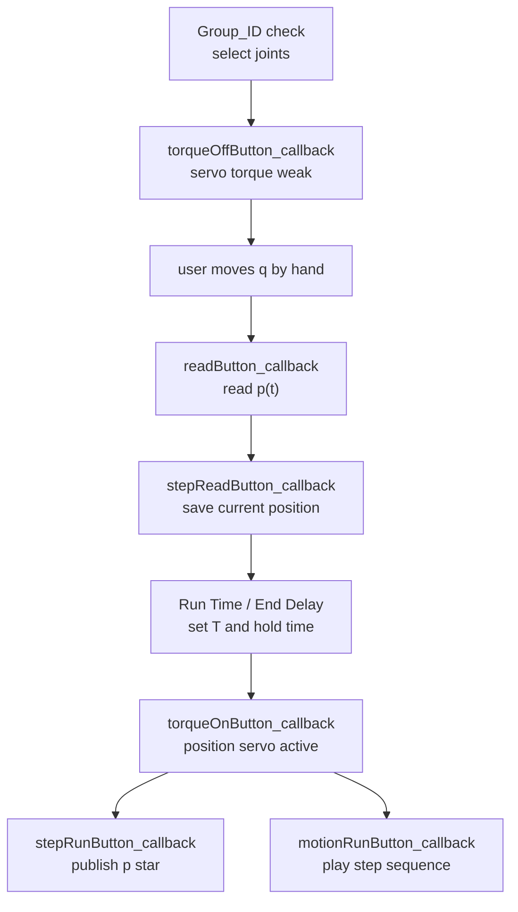
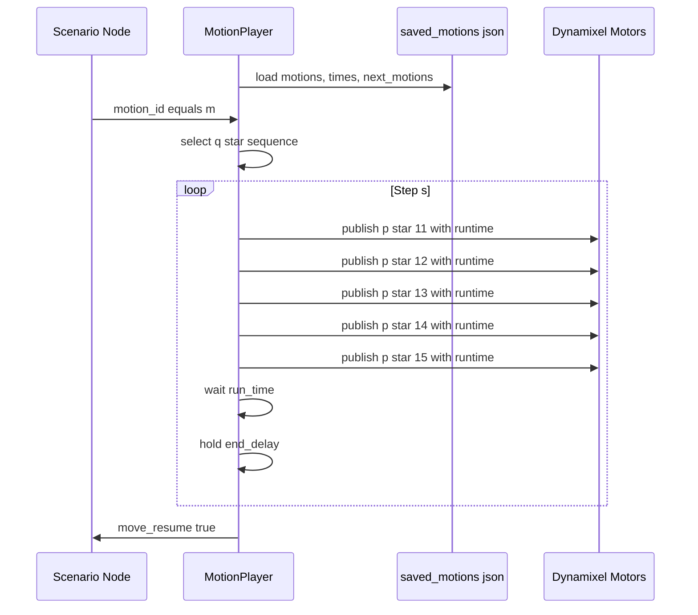
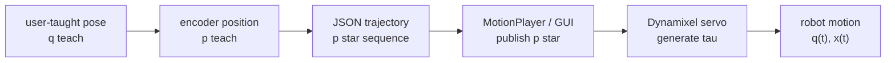

# Robot Motion Physics for This Code

이 문서는 현재 매니퓰레이터 코드의 변수, 함수, 토픽을 로봇 물리 개념과 연결해서 설명합니다. 중심 물리량은 관절 위치 $q$, 엔코더 위치 $p$, 목표 위치 $q^\ast$, 이동 시간 $T$, 모터 토크 $\tau$입니다.

## 1. 코드가 다루는 물리량

현재 로봇팔은 Dynamixel 5개를 관절로 사용합니다.

```python
DXL_IDS = [11, 12, 13, 14, 15]
```

물리적으로는 5자유도 관절좌표계입니다.

$$
q =
\begin{bmatrix}
q_1 & q_2 & q_3 & q_4 & q_5
\end{bmatrix}^{T}
$$

코드는 관절각 $q_i$에 대응되는 Dynamixel 엔코더 position $p_i$를 저장하고 재생합니다.

$$
p =
\begin{bmatrix}
p_{11} & p_{12} & p_{13} & p_{14} & p_{15}
\end{bmatrix}^{T}
$$

`manipulatorGUI.py`의 내부 배열은 이 $p$ 벡터를 Motion/Step 단위로 저장합니다.

```python
self.motions[motion_index][step_index]
```

물리적으로는 다음 목표 관절자세입니다.

$$
p^\ast_{m,s}
=
\begin{bmatrix}
p^\ast_{11} &
p^\ast_{12} &
p^\ast_{13} &
p^\ast_{14} &
p^\ast_{15}
\end{bmatrix}^{T}
$$

코드에서 배열 인덱스는 `dxl_id - 11`로 계산됩니다.

| Dynamixel ID | 배열 인덱스 | 물리 좌표 |
| --- | ---: | --- |
| `DXL_ID 11` | `0` | $q_1,\ p_{11}$ |
| `DXL_ID 12` | `1` | $q_2,\ p_{12}$ |
| `DXL_ID 13` | `2` | $q_3,\ p_{13}$ |
| `DXL_ID 14` | `3` | $q_4,\ p_{14}$ |
| `DXL_ID 15` | `4` | $q_5,\ p_{15}$ |

## 2. 엔코더 position과 관절각

Dynamixel raw position $p_i$는 엔코더 tick입니다. 관절각 $q_i$로 해석할 때는 기준점과 방향 부호를 둡니다.

$$
q_i = s_i\frac{2\pi}{N}(p_i - p_{i,0})
$$

| 기호 | 코드/로봇에서의 의미 |
| --- | --- |
| $p_i$ | GUI의 `current`, `saved`, JSON의 position 값 |
| $p_{i,0}$ | 기준 자세의 엔코더 position |
| $N$ | 1회전당 tick 수 |
| $s_i$ | 관절 설치 방향에 따른 부호 |
| $q_i$ | 물리 해석에 사용하는 관절각 |

코드 흐름에서는 $p_i$를 그대로 읽고, 저장하고, 다시 보냅니다.



## 3. Step은 목표 관절자세

GUI의 Step 하나는 5개 관절의 목표 position 벡터입니다.

```python
self.motions[m][s] = [p11, p12, p13, p14, p15]
```

수식으로는:

$$
\mathrm{Step}_{m,s} = p^\ast_{m,s}
$$

관절각으로 환산하면:

$$
\mathrm{Step}_{m,s} = q^\ast_{m,s}
$$

`stepReadButton_callback()`은 현재 엔코더 값을 Step 목표값으로 복사합니다.

```python
self.motions[self.motion][self.step][motor.dxl_id - 11] = int(text)
```

물리적으로는 현재 자세 $q(t)$를 목표 자세 $q^\ast_{m,s}$로 기록하는 순간입니다.

$$
q^\ast_{m,s} \leftarrow q(t_{\mathrm{teach}})
$$

## 4. Motion은 관절공간 궤적

Motion 하나는 Step들의 순서열입니다.

```python
self.motions[motion_index]
```

수식으로는:

$$
\mathrm{Motion}_m
=
\left\{
q^\ast_{m,1},
q^\ast_{m,2},
\cdots,
q^\ast_{m,N_m}
\right\}
$$

실행 중에는 목표 관절자세가 다음 순서로 바뀝니다.

$$
q^\ast_{m,1}
\rightarrow
q^\ast_{m,2}
\rightarrow
\cdots
\rightarrow
q^\ast_{m,N_m}
$$

`run_motion()`과 `execute_motion()`은 이 순서열을 읽고 각 Step의 position을 `/set_position`으로 발행합니다.



## 5. Run Time은 평균 관절속도를 정한다

각 Step에는 이동 시간과 대기 시간이 붙습니다.

```python
self.times[motion_index][step_index] = [run_time, end_delay]
```

`run_time`을 $T_s$, 연속된 두 Step을 $q^\ast_s, q^\ast_{s+1}$라 두면 평균 관절속도는:

$$
\bar{\dot{q}}_s
=
\frac{q^\ast_{s+1} - q^\ast_s}{T_s}
$$

엔코더 position 단위로 보면:

$$
\bar{\dot{p}}_s
=
\frac{p^\ast_{s+1} - p^\ast_s}{T_s}
$$

`runtime`이 작을수록 같은 position 차이를 더 빠르게 이동합니다.

$$
T_s \downarrow
\quad\Rightarrow\quad
\left\lVert \bar{\dot{q}}_s \right\rVert \uparrow
$$

`end_delay`는 Step 도달 뒤 자세를 유지하는 시간입니다.

$$
\dot{q} \approx 0,
\quad
t \in [T_s, T_s + T_{\mathrm{delay}}]
$$

## 6. `/set_position`은 목표 관절 위치 명령

GUI와 Ctrl 노드는 같은 물리 명령을 사용합니다.

```python
msg.id = motor_id
msg.position = target_position
msg.runtime = run_time
```

수식으로는 $i$번째 관절에 목표값과 이동 시간을 주는 명령입니다.

$$
p_i^\ast \leftarrow \mathtt{msg.position}
$$

$$
T \leftarrow \mathtt{msg.runtime}
$$

Dynamixel 내부 위치 제어기는 목표 위치와 엔코더 피드백의 오차를 줄이는 방향으로 토크를 만듭니다.

$$
e_i(t) = q_i^\ast(t) - q_i(t)
$$

대표적인 서보 제어 형태는:

$$
\tau_i =
K_{p,i}e_i
- K_{d,i}\dot{q}_i
+ K_{i,i}\int e_i\,dt
$$

코드와 물리 계층은 다음처럼 연결됩니다.



## 7. `/get_position`은 엔코더 피드백 읽기

`readButton_callback()`은 선택된 모터마다 현재 position을 요청합니다.

```python
motor.request_position(self.position_response_callback)
```

서비스 응답은 다음 값을 GUI에 반영합니다.

```python
motor.curPosition = response.position
self.currentLineEdits[dxl_id].setText(str(motor.curPosition))
```

물리적으로는 현재 관절 상태를 샘플링하는 과정입니다.

$$
p_i(t_{\mathrm{read}}) \rightarrow \mathtt{current}
$$

이 값이 `save step`에서 목표값으로 저장됩니다.

$$
p_i^\ast \leftarrow p_i(t_{\mathrm{read}})
$$

## 8. Torque ON/OFF는 서보 활성 상태 전환

`torqueOffButton_callback()`은 선택된 모터의 서보 토크를 약하게 만듭니다.

```python
motor.set_torque(False)
```

물리적으로는 사용자가 손으로 관절을 움직이기 쉬운 상태입니다.

$$
\tau_i^{\mathrm{servo}} \approx 0
$$

`torqueOnButton_callback()`은 선택된 모터의 위치 제어를 활성화합니다.

```python
motor.set_torque(True)
```

물리적으로는 내부 위치 제어기가 목표 자세를 유지하거나 목표 자세로 이동하는 상태입니다.

$$
\tau_i =
\tau_i^{\mathrm{servo}}(q_i^\ast, q_i, \dot{q}_i)
$$

티칭 과정은 다음 물리 흐름입니다.



## 9. 정기구학: 저장한 관절자세가 말단 위치를 만든다

말단 위치와 자세는 관절각의 함수입니다.

$$
x = f(q)
$$

여기서:

$$
x =
\begin{bmatrix}
r \\
\phi
\end{bmatrix},
\quad
r =
\begin{bmatrix}
x & y & z
\end{bmatrix}^{T}
$$

GUI는 관절공간 목표 $q^\ast$를 저장하고, 로봇 말단은 정기구학에 의해 $x^\ast=f(q^\ast)$ 위치로 갑니다.

$$
q^\ast
\xrightarrow{f}
x^\ast
$$

DH 파라미터를 사용하면 각 링크 변환은:

$$
{}^{i-1}T_i =
\begin{bmatrix}
\cos\theta_i & -\sin\theta_i\cos\alpha_i & \sin\theta_i\sin\alpha_i & a_i\cos\theta_i \\
\sin\theta_i & \cos\theta_i\cos\alpha_i & -\cos\theta_i\sin\alpha_i & a_i\sin\theta_i \\
0 & \sin\alpha_i & \cos\alpha_i & d_i \\
0 & 0 & 0 & 1
\end{bmatrix}
$$

전체 말단 변환은:

$$
{}^0T_n(q)
=
{}^0T_1(q_1)
{}^1T_2(q_2)
\cdots
{}^{n-1}T_n(q_n)
$$

코드를 읽을 때는 `saved` position 하나가 말단의 한 작업공간 포즈 $x^\ast$를 만드는 입력이라고 보면 됩니다.

## 10. 자코비안: runtime이 말단속도로 번역되는 방식

관절속도와 말단속도는 자코비안으로 연결됩니다.

$$
\dot{x} = J(q)\dot{q}
$$

Step 사이 평균 관절속도:

$$
\bar{\dot{q}}_s
=
\frac{q^\ast_{s+1}-q^\ast_s}{T_s}
$$

따라서 평균 말단속도는:

$$
\bar{\dot{x}}_s
\approx
J(q)
\frac{q^\ast_{s+1}-q^\ast_s}{T_s}
$$

코드의 `Run Time`을 줄이면 관절속도와 말단속도가 함께 커집니다. 같은 `Run Time`이라도 자세 $q$에 따라 $J(q)$가 달라지므로 말단 움직임의 체감 속도도 달라집니다.

특이점은 자코비안 랭크가 줄어드는 자세입니다.

$$
\operatorname{rank}J(q) < \min(m,n)
$$

특이점 근처에서는 일부 방향의 말단 움직임이 커지거나 민감해집니다. 티칭한 두 Step 사이가 이런 자세를 지나면 같은 `runtime`에서도 움직임이 급해 보일 수 있습니다.

## 11. 동역학: 모터 토크가 실제 팔을 움직인다

직렬 매니퓰레이터의 동역학은:

$$
M(q)\ddot{q}
+ C(q,\dot{q})\dot{q}
+ g(q)
+ \tau_f
=
\tau
$$

| 항 | 물리 의미 | 코드와의 연결 |
| --- | --- | --- |
| $M(q)\ddot{q}$ | 관성 토크 | `runtime`이 짧을수록 요구 가속도 증가 |
| $C(q,\dot{q})\dot{q}$ | 코리올리/원심력 | 빠른 관절 이동에서 영향 증가 |
| $g(q)$ | 중력 토크 | 팔을 뻗은 자세, 물체 파지에서 부담 증가 |
| $\tau_f$ | 마찰/감속기 손실 | 저속 움직임, 정지 유지에 영향 |
| $\tau$ | 모터 토크 | Dynamixel 내부 제어기가 생성 |

라그랑지안 관점에서는:

$$
L(q,\dot{q}) = T(q,\dot{q}) - V(q)
$$

$$
\frac{d}{dt}
\frac{\partial L}{\partial \dot{q}_i}
-
\frac{\partial L}{\partial q_i}
=
\tau_i
$$

코드의 `/set_position`은 내부 서보가 $\tau_i$를 만들도록 목표 $q_i^\ast$를 지정하는 명령입니다.

$$
q_i^\ast
\rightarrow
e_i
\rightarrow
\tau_i
\rightarrow
\ddot{q}_i
$$

## 12. 궤적 보간과 Step 간 움직임

Step $s$에서 Step $s+1$로 이동할 때 이상적인 관절공간 선형 보간은:

$$
q_d(t)
=
q_s
+
\frac{t}{T}
(q_{s+1}-q_s),
\quad
0 \le t \le T
$$

평균 속도는:

$$
\dot{q}_d
=
\frac{q_{s+1}-q_s}{T}
$$

더 부드러운 시작과 정지를 원하면 3차 보간을 사용합니다.

$$
q_d(t)
=
q_s
+
3\left(\frac{t}{T}\right)^2(q_{s+1}-q_s)
-
2\left(\frac{t}{T}\right)^3(q_{s+1}-q_s)
$$

가속도까지 부드럽게 맞추는 5차 보간은:

$$
q_d(t)
=
q_s
+
\left(10r^3 - 15r^4 + 6r^5\right)
(q_{s+1}-q_s),
\quad
r=\frac{t}{T}
$$

현재 코드에서 `msg.runtime`은 하위 제어 계층이 목표 이동 시간을 해석하는 입력입니다. 코드 확장 시에는 `run_motion()` 내부에서 $q_d(t)$를 샘플링해 중간 position들을 연속 발행하는 방식으로 더 명시적인 궤적 생성기를 둘 수 있습니다.

## 13. 중력, 하중, 자세 유지

로봇팔은 링크 자세와 하중에 따라 필요한 토크가 달라집니다. 단일 링크 예시는:

$$
\tau_g = mgl\sin\theta
$$

매니퓰레이터 전체에서는:

$$
\tau_g = g(q)
$$

말단 힘 $F$가 관절토크로 변환되는 관계는:

$$
\tau = J(q)^T F
$$

그리퍼가 물체를 잡으면 $F$가 커지고, 팔을 뻗은 자세에서는 $J(q)^T F$가 특정 관절에 크게 걸릴 수 있습니다. 이런 상황에서는 같은 Step과 같은 `runtime`이라도 실제 도달 시간, 정착 오차, 진동 양상이 달라집니다.

코드와 연결하면:

- `saved` position은 목표 자세를 정한다.
- `runtime`은 필요한 평균 속도와 가속도 수준을 정한다.
- 하중과 자세는 서보가 만들어야 하는 $\tau$를 정한다.
- `end_delay`는 도달 후 진동이 가라앉을 시간을 준다.

## 14. `manipulatorGUI.py`의 물리 흐름



주요 함수와 물리 의미:

| 함수 | 코드 동작 | 물리 해석 |
| --- | --- | --- |
| `readButton_callback()` | `/get_position` 호출 | 현재 $p(t)$ 샘플링 |
| `stepReadButton_callback()` | current를 saved와 `motions`에 저장 | $p^\ast \leftarrow p(t)$ |
| `stepRunButton_callback()` | 선택 Step의 position 발행 | $p \rightarrow p^\ast$ 이동 |
| `run_motion()` | Step sequence 반복 실행 | 관절공간 궤적 재생 |
| `torqueOnButton_callback()` | `/set_torque true` | 위치 제어 활성화 |
| `torqueOffButton_callback()` | `/set_torque false` | 수동 티칭 상태 |

## 15. `manipulatorCtrl.py`의 물리 흐름

`manipulatorCtrl.py`는 저장된 JSON을 읽고 외부 명령으로 Motion을 재생합니다.

`saved_motions.json`은 관절공간 궤적 파일입니다. 하나의 JSON 파일이 목표 관절자세열, 이동 시간, 유지 시간, 반복 횟수, 다음 Motion 전이를 담습니다.

$$
\mathtt{saved\_motions.json}
=
\left\{
Q_m,\ T_m,\ H_m,\ R_m,\ \mathrm{next}_m
\right\}_{m=1}^{M}
$$

| JSON key | 코드 자료구조 | 물리/제어 의미 |
| --- | --- | --- |
| `motions` | `self.motions` | 목표 관절자세열 $Q_m$ |
| `times[][0]` | `move_time` | 이동 시간 $T_{m,s}$ |
| `times[][1]` | `stop_time` | 자세 유지 시간 $H_{m,s}$ |
| `spin_numbers` | `spin_count` | 같은 궤적 반복 횟수 $R_m$ |
| `next_motions` | `next_motion` | Motion 간 이산 전이 |



`/manipulator/motion_id`는 상위 시나리오가 보내는 이산 명령입니다.

$$
\mathtt{motion\_id}=m
\quad\Rightarrow\quad
Q_m\ \mathrm{playback}
$$

`/move_resume`은 마지막 Step의 이동 시간과 유지 시간이 끝난 뒤 발행되는 완료 이벤트입니다.

$$
t \ge
\sum_s
\left(
T_{m,s}
+
H_{m,s}
\right)
\quad\Rightarrow\quad
\mathtt{/move\_resume=True}
$$

`execute_motion()`의 핵심 루프는 다음 물리량을 순서대로 사용합니다.

```python
for step_idx, joint_positions in enumerate(steps):
    move_time, stop_time = times[step_idx]
```

수식으로는:

$$
\left(p^\ast_s, T_s, T_{\mathrm{delay},s}\right),
\quad
s=1,\dots,N
$$

각 Step마다 5개 관절에 같은 $T_s$가 적용됩니다. 그래서 Step 사이의 관절별 평균속도는:

$$
\bar{\dot{p}}_{i,s}
=
\frac{p^\ast_{i,s+1}-p^\ast_{i,s}}{T_s}
$$

관절별 position 차이가 클수록 해당 관절이 더 빠르게 움직입니다.

## 16. 티칭 재생 방식의 해석

이 패키지의 제어 스타일은 teach-and-playback joint position control입니다.



사용자는 실제 로봇팔을 움직여 $q^\ast$를 선택하고, 이 수동 선택 과정이 작업공간 목표 $x^\ast$에 대응되는 관절자세를 정합니다.

$$
\mathrm{human\ teaching}
\quad\Rightarrow\quad
q^\ast
\quad\Rightarrow\quad
x^\ast=f(q^\ast)
$$

물체 위치가 바뀌는 응용에서는 티칭된 $q^\ast$ 위에 시나리오 판단이 붙습니다.

- 물체 위치별 Motion 선택
- 카메라 인식 결과에 따른 Step 보정
- $q^\ast = f^{-1}(x^\ast)$ 기반 목표 관절각 생성
- 기존 Motion의 일부 Step만 교체

## 17. 코드 플로우와 물리 플로우 대응

아래 다이어그램은 코드 플로우와 물리 플로우를 세로 두 열로 대응시킨 것입니다. 왼쪽 열은 코드 이벤트, 오른쪽 열은 그 이벤트가 의미하는 물리 상태입니다.

$$
\begin{array}{c|c}
\textbf{Code\ flow} & \textbf{Physics\ flow} \\
\hline
\begin{array}{c}
\mathtt{motor.set\_torque(False)} \\
\downarrow
\end{array}
&
\begin{array}{c}
\tau_i^{\mathrm{servo}}\approx 0 \\
q_i\leftarrow q_i+\Delta q_i^{\mathrm{human}} \\
\downarrow
\end{array}
\\[1.3em]
\begin{array}{c}
\mathtt{request\_position()} \\
\mathtt{curPosition=response.position} \\
\downarrow
\end{array}
&
\begin{array}{c}
p_i(t_{\mathrm{read}})
=
\mathrm{encoder}_i(t_{\mathrm{read}}) \\
q_i(t_{\mathrm{read}})
=
s_i\dfrac{2\pi}{N}
\left(p_i(t_{\mathrm{read}})-p_{i,0}\right) \\
\downarrow
\end{array}
\\[1.9em]
\begin{array}{c}
\mathtt{motions[m][s][i]=current} \\
\downarrow
\end{array}
&
\begin{array}{c}
p^\ast_{m,s,i}
\leftarrow
p_i(t_{\mathrm{teach}}) \\
q^\ast_{m,s}
\leftarrow
q(t_{\mathrm{teach}}) \\
\downarrow
\end{array}
\\[1.5em]
\begin{array}{c}
\mathtt{times[m][s]} \\
=
\mathtt{[run\_time,end\_delay]} \\
\downarrow
\end{array}
&
\begin{array}{c}
T_{m,s}=\mathtt{run\_time},
\quad
H_{m,s}=\mathtt{end\_delay} \\
\bar{\dot q}_{m,s}
\approx
\dfrac{q^\ast_{m,s+1}-q^\ast_{m,s}}{T_{m,s}} \\
\downarrow
\end{array}
\\[1.9em]
\begin{array}{c}
\mathtt{publish(SetPosition)} \\
\downarrow
\end{array}
&
\begin{array}{c}
\mathtt{/set\_position}:
(i,\ p_i^\ast,\ T) \\
p_i(t)\rightarrow p_i^\ast \\
\downarrow
\end{array}
\\[1.5em]
\begin{array}{c}
\mathtt{Dynamixel\ feedback\ loop} \\
\downarrow
\end{array}
&
\begin{array}{c}
e_i=q_i^\ast-q_i \\
\tau_i
=
K_{p,i}e_i
-K_{d,i}\dot q_i
+K_{i,i}\int e_i\,dt \\
M(q)\ddot q+C(q,\dot q)\dot q+g(q)+\tau_f=\tau \\
\downarrow
\end{array}
\\[2.1em]
\begin{array}{c}
\mathtt{move\_resume\_pub.publish(True)}
\end{array}
&
\begin{array}{c}
t\ge\sum_s(T_{m,s}+H_{m,s}) \\
\Rightarrow
\mathtt{/move\_resume=True}
\end{array}
\end{array}
$$

### C1/P1: Torque OFF와 수동 티칭

코드:

```python
motor.set_torque(False)
```

물리:

$$
\tau_i^{\mathrm{servo}} \approx 0,
\qquad
q_i \leftarrow q_i + \Delta q_i^{\mathrm{human}}
$$

서보가 자세를 강하게 붙잡는 상태를 풀고, 사람이 외력을 가해 관절좌표 $q$를 직접 바꿉니다.

### C2/P2: 현재 position 읽기

코드:

```python
motor.request_position(self.position_response_callback)
motor.curPosition = response.position
```

물리:

$$
p_i(t_{\mathrm{read}})
=
\mathrm{encoder}_i(t_{\mathrm{read}})
$$

$$
q_i(t_{\mathrm{read}})
=
s_i\frac{2\pi}{N}
\left(
p_i(t_{\mathrm{read}})-p_{i,0}
\right)
$$

GUI의 `current` 칸은 엔코더가 샘플링한 현재 관절 상태입니다.

### C3/P3: 현재 자세를 Step 목표로 저장

코드:

```python
self.motions[self.motion][self.step][motor.dxl_id - 11] = int(text)
```

물리:

$$
p^\ast_{m,s,i}
\leftarrow
p_i(t_{\mathrm{teach}})
$$

$$
q^\ast_{m,s}
=
\begin{bmatrix}
q^\ast_{m,s,1} &
q^\ast_{m,s,2} &
\cdots &
q^\ast_{m,s,5}
\end{bmatrix}^{T}
$$

Step 저장은 현재 로봇 자세를 미래에 재생할 목표 관절자세로 채택하는 과정입니다.

### C4/P4: runtime과 end delay가 시간 파라미터를 정한다

코드:

```python
self.times[motion_index][step_index] = [run_time, end_delay]
```

물리:

$$
T_{m,s} = \mathtt{run\_time},
\qquad
H_{m,s} = \mathtt{end\_delay}
$$

$$
\bar{\dot{q}}_{m,s}
\approx
\frac{
q^\ast_{m,s+1}
-
q^\ast_{m,s}
}{
T_{m,s}
}
$$

`runtime`은 평균 관절속도 스케일을 정하고, `end_delay`는 목표 도달 후 자세 유지 시간을 정합니다.

### C5/P5: `/set_position`은 원하는 관절 운동을 시작한다

코드:

```python
msg.id = motor_id
msg.position = target_position
msg.runtime = run_time
self.positionPublisher.publish(msg)
```

물리:

$$
\mathtt{/set\_position}
:
\left(
i,\ p_i^\ast,\ T
\right)
$$

$$
p_i(t)
\rightarrow
p_i^\ast
\quad
\mathrm{during}
\quad
T
$$

상위 Python 노드는 목표 position과 이동 시간을 보내고, 하위 Dynamixel 제어 계층이 그 목표를 추종합니다.

### C6/P6: 서보 오차가 토크가 되고 동역학을 움직인다

코드 관점에서는 `/set_position` 발행 뒤 Dynamixel 쪽에서 엔코더 피드백이 닫힌 루프를 이룹니다.

물리:

$$
e_i(t)=q_i^\ast(t)-q_i(t)
$$

$$
\tau_i
=
K_{p,i}e_i
-K_{d,i}\dot{q}_i
+K_{i,i}\int e_i\,dt
$$

$$
M(q)\ddot{q}
+C(q,\dot{q})\dot{q}
+g(q)
+\tau_f
=
\tau
$$

위치 오차 $e_i$가 서보 토크 $\tau_i$로 변환되고, 이 토크가 실제 링크 관성, 중력, 마찰을 이기며 $q(t)$를 바꿉니다.

### C7/P7: Motion 완료와 상위 시나리오 재개

코드:

```python
self.move_resume_pub.publish(Bool(data=True))
```

물리/이벤트:

$$
t \ge
\sum_s
\left(
T_{m,s}+H_{m,s}
\right)
\quad\Rightarrow\quad
\mathtt{/move\_resume=True}
$$

마지막 Step의 이동과 유지 시간이 끝나면 매니퓰레이터 동작 완료 이벤트가 상위 시나리오로 전달됩니다.

### 한눈에 보는 대응식

$$
\begin{aligned}
\mathtt{current}
&\leftrightarrow p_i(t) \\
\mathtt{saved}
&\leftrightarrow p_i^\ast \\
\mathtt{motions}[m][s][i]
&\leftrightarrow p^\ast_{m,s,i} \\
\mathtt{times}[m][s][0]
&\leftrightarrow T_{m,s} \\
\mathtt{times}[m][s][1]
&\leftrightarrow H_{m,s} \\
\mathtt{/set\_position}
&\leftrightarrow (i,\ p_i^\ast,\ T) \\
\mathtt{/get\_position}
&\leftrightarrow p_i(t_{\mathrm{read}}) \\
\mathtt{/move\_resume}
&\leftrightarrow t \ge \sum_s (T_{m,s}+H_{m,s})
\end{aligned}
$$

## 18. 코드 읽기 체크리스트

코드를 읽을 때는 다음 대응을 계속 떠올리면 됩니다.

| 코드 | 물리량 |
| --- | --- |
| `motor.curPosition` | 현재 엔코더 위치 $p_i(t)$ |
| `currentLineEdits` | 관측된 $p_i(t)$ 표시 |
| `savedLineEdits` | 목표 $p_i^\ast$ 표시 |
| `self.motions[m][s][i]` | $m$번 Motion, $s$번 Step, $i$번 관절 목표 position |
| `self.times[m][s][0]` | 이동 시간 $T_s$ |
| `self.times[m][s][1]` | 자세 유지 시간 $T_{\mathrm{delay},s}$ |
| `publish_position(value, runTime)` | $p_i^\ast, T_s$ 명령 |
| `set_torque(True/False)` | 서보 토크 상태 전환 |
| `run_motion()` | $q^\ast_1 \to q^\ast_2 \to \cdots$ 재생 |
| `execute_motion()` | JSON 기반 $p^\ast$ sequence 재생 |

전체 구조를 한 줄로 쓰면:

$$
\mathrm{GUI}
\Rightarrow
p^\ast_{m,s}
\Rightarrow
\mathtt{/set\_position}
\Rightarrow
\tau
\Rightarrow
q(t)
\Rightarrow
x(t)=f(q(t))
$$
